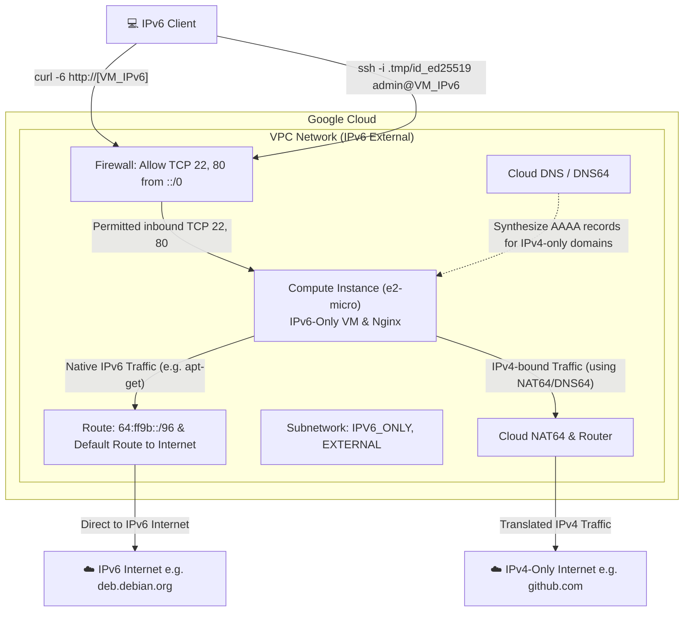

# IPv6 External Network with DNS64/NAT64

This Terraform module demonstrates how to configure a Google Cloud Compute Engine VM in an **IPv6-only, external** network setup. The VM has a publicly routable IPv6 address and no IPv4 address. 

To allow the VM to download packages from IPv4-only domains (such as standard Debian `apt` repositories or `github.com`), the network is configured with **NAT64** and **DNS64**. The VM's firewall is explicitly opened to allow SSH (port 22) and HTTP (port 80) access from any IPv6 client.

## Architecture Diagram



## Setup & Deployment

1. **Initialize Terraform:**
   ```bash
   terraform init
   ```

2. **Validate the configuration:**
   ```bash
   terraform validate
   ```

3. **Deploy the infrastructure:**
   ```bash
   terraform apply
   ```

## Verifying the Setup

After Terraform finishes, it will output several useful test commands.

### 1. Web Server Access
Test that Nginx is running and accessible over the public IPv6 address:
```bash
$(terraform output -raw http_test_command)
# or manually:
curl -6 http://[$(terraform output -raw vm_external_ipv6)]
```

### 2. SSH Access
SSH into the machine. The firewall allows SSH from the public internet (i.e. `::/0`):
```bash
$(terraform output -raw ssh_command)
```

### 3. DNS64 and NAT64 Verification
Verify that the VM can natively pull content from an IPv4-only domain like `github.com` via the synthesized DNS64 and Cloud NAT64 setup. The startup script installs and configures Nginx this way, but you can manually verify:
```bash
$(terraform output -raw github_dns64_test_command)
# or securely log in and run:
curl -6is https://github.com
```

## Cleanup

To destroy all associated resources:
```bash
terraform destroy
```
