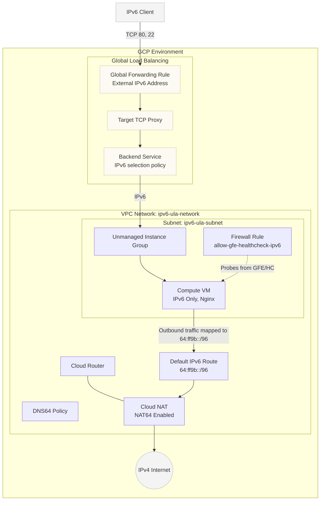

# IPv6-Only with IPv4 Admin Access

This Terraform configuration demonstrates how to deploy an IPv6-only backend VM in Google Cloud and expose it to the IPv4 Internet via a Global External Proxy Network Load Balancer to administer it (ie via ssh and/or a k8s control plane). 

It includes all necessary networking components, such as DNS64, NAT64, and specialized Firewall policies, to ensure the IPv6-only VM can both serve external traffic and reach the outside world (e.g., for package updates).

## Architecture Diagram

The diagram below illustrates the network flow and the resources deployed by this configuration:



## Resource Breakdown

Here is a summary of the key resources created by this Terraform code and what they contribute:

### 1. Networking (VPC & Subnet)
*   **VPC Network (`google_compute_network`)**: A regional network with `enable_ula_internal_ipv6 = true`, supporting internal ULA IPv6 addressing.
*   **Subnet (`google_compute_subnetwork`)**: Configured with `stack_type = "IPV6_ONLY"` and `ipv6_access_type = "INTERNAL"`. The backend VM lives here and has no IPv4 address.

### 2. Egress Traffic (NAT64 & DNS64)
Because the VM is IPv6-only, it needs a way to communicate with IPv4-only external services (like debian apt repositories).
*   **DNS64 Policy (`google_dns_policy`)**: Translates IPv4 DNS responses (A records) into synthetic IPv6 addresses (AAAA records).
*   **Cloud NAT & Cloud Router (`google_compute_router_nat`, `google_compute_router`)**: Configured to provide NAT64 translation (`source_subnetwork_ip_ranges_to_nat64 = "ALL_IPV6_SUBNETWORKS"`). 
*   **IPv6 Default Route (`google_compute_route`)**: Routes the synthetic NAT64 prefix (`64:ff9b::/96`) to the default internet gateway, effectively mapping outbound traffic to the NAT64 service.

### 3. Backend Instance
*   **Compute Instance (`google_compute_instance`)**: An e2-micro instance configured with only an IPv6 interface. Its startup script installs Nginx to serve HTTP requests and modifies `/etc/gai.conf` to prefer the NAT64 prefix.
*   **Instance Group (`google_compute_instance_group`)**: An unmanaged group containing the VM. This is required to attach the VM to the load balancer backend service.

### 4. Load Balancing & Ingress
The load balancer provides an **IPv6 frontend** that proxies TCP connections to the unified IPv6-only backend.
*   **Global Addresses (`google_compute_global_address`)**: Public IPv6 address for clients to connect to.
*   **Forwarding Rules & Proxies (`google_compute_global_forwarding_rule`, `google_compute_target_tcp_proxy`)**: Listens on the IPv6 address for TCP ports 80 (HTTP) and 22 (SSH), forwarding traffic to the backend services over a TCP Proxy.
*   **Backend Services & Health Checks (`google_compute_backend_service`, `google_compute_health_check`)**: Manages the instances and checks their health. The key setting here is `ip_address_selection_policy = "IPV6_ONLY"`, which forces the Google Front Ends (GFE) to connect to our IPv6 backend.
*   **Firewall Rule (`google_compute_firewall`)**: Allows inbound TCP traffic on ports 22 and 80 from the known Google Front End and Load Balancer health check IPv6 ranges (`2600:1901:8001::/48`, `2600:2d00:1:b029::/64`, `2600:2d00:1:1::/64`).

## Usage

1. Initialize and apply the terraform code:
   ```sh
   terraform init
   terraform apply
   ```
2. Once applied, test HTTP traffic (IPv6):
   ```sh
   $(terraform output -raw http_test_command)
   ```
3. Test SSH connection (IPv6):
   ```sh
   $(terraform output -raw ssh_command)
   ```
